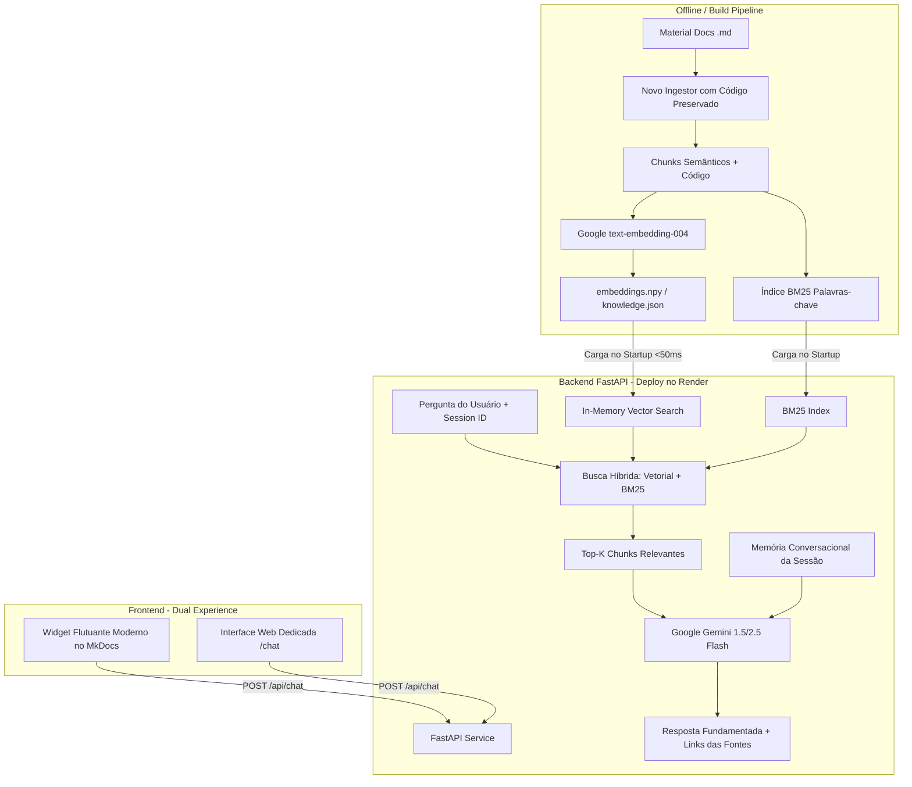

# Diretrizes e Arquitetura do CP5 — Disruptive Architectures (IA e IoT)

Documento consolidado de especificações, decisões de arquitetura e plano de implementação para o **Checkpoint 5 (CP5)**.

---

## 1. Visão Geral do Checkpoint 5 (CP5)

Conforme estabelecido em `Checkpoint 5.txt`:
* **Peso:** 20 pontos ("CPZão").
* **Formato:** Grupo de até 5 pessoas.
* **Data da Apresentação:** 09/10/2026.
* **Tema Principal:** Chat com **RAG (Retrieval-Augmented Generation)** alimentado com o conteúdo completo do site da disciplina (*Disruptive Architectures: IA e IoT*).
* **Critérios Mandatórios:**
  1. **Sistema Completo End-to-End:** Ingestão de conteúdo, geração de embeddings, armazenamento/indexação vetorial, orquestração RAG e interface do usuário.
  2. **Com Deploy Funcional:** Aplicação e API publicadas e operacionais na nuvem pública via HTTPS.
  3. **QUALIDADE DA RESPOSTA (Fator Crítico 20/20):** Respostas precisas, fundamentadas estritamente no material das aulas, preservação de exemplos de código, links diretos para as páginas e ausência de alucinações.

---

## 2. Varredura dos Conteúdos da Disciplina (Base de Conhecimento)

O site em **MkDocs Material** organiza todo o conteúdo acadêmico ministrado pelo Prof. Arnaldo Viana:

### 1º Semestre — Internet das Coisas (IoT)
* **Arduino & Eletrônica:** Entradas/saídas digitais e analógicas, PWM, debouncing, FSM (Máquinas de Estados Finitas), EEPROM.
* **ESP32 & Conectividade:** Wi-Fi, WebServer HTTP embarcado, endpoints de monitoramento/acionamento, APIs REST e serialização JSON.
* **Protocolos e Mensageria:** MQTT (Broker, Pub/Sub, QoS 0/1/2, tópicos, retenção, LWT).
* **Gateways e Dashboards:** Node-RED (construção de flows, bridge HTTP ↔ MQTT, normalização de dados e dashboards para telemetria).

### 2º Semestre — Inteligência Artificial & GenAI
* **GenAI (Laboratórios Práticos — Foco do Semestre):**
  * **Lab 1:** Engenharia de Prompts (estruturação de contexto, personas, delimitação de respostas).
  * **Lab 2:** Assistentes Conversacionais e gerenciamento de sessões com memória.
  * **Lab 2.5:** Python aplicado a ecossistemas de IA.
  * **Lab 3:** Function Calling / Tool Calling e Saídas Estruturadas com Pydantic.
  * **Lab 3.5:** Do protótipo ao produto (APIs desacopladas, Docker, persistência e arquitetura fora do Colab).
  * **Lab 4:** **RAG e Bases de Conhecimento** (divisão em chunks, embeddings, busca semântica por cosseno, redução de alucinações e citação de fontes).
* **Machine Learning / Visão Computacional (Teoria/Notebooks):**
  * Exploração com DataFrames, Classificação KNN, Regressão, Perceptrons, MLP, CNN, Transfer Learning e detecção de objetos com YOLO.

---

## 3. Decisões Arquiteturais Consolidadas (/grill-me)

Após o processo interativo de alinhamento técnico, a arquitetura da solução foi definida:



### Detalhamento das Decisões:

| Componente | Decisão Escolhida | Justificativa |
| :--- | :--- | :--- |
| **Código Antigo do Professor** | Movido para `referencia_professor/` | Mantém os scripts do professor acessíveis para consulta comparativa, deixando o workspace limpo para nossa própria solução. |
| **Backend & Runtime** | **Python (FastAPI)** | Total aderência aos laboratórios de GenAI do 2º semestre (Labs 1 a 4). Modular, assíncrono e de alto desempenho. |
| **Provedor de IA (LLM & Embeddings)** | **Google Gemini (`gemini-embedding-2` + `gemini-3.5-flash-lite`)** | Modelo de última geração ultrarrápido, de alta precisão e baixo consumo de tokens via Google AI Studio. |
| **Armazenamento Vetorial** | **In-Memory Store (NumPy/FAISS) via arquivo estático** | A base possui ~250 chunks (1 MB). Carregar na memória no boot é instantâneo (<50ms), sem custos, sem dependências de serviços externos e sem falhas de conexão no deploy. |
| **Qualidade da Recuperação** | **Busca Híbrida (Semântica + BM25) + Preservação de Código** | Corrige o principal defeito do professor (que apagava código). Garante resposta precisa para termos técnicos de IoT (ex: `digitalRead`, `MQTT QoS 1`, `ESP32`) e perguntas conceituais. |
| **Memória Conversacional** | **Sessões Multi-turn** | Permite que o estudante faça perguntas de acompanhamento ("Como adapto isso para o ESP32?", "Me mostre o código"). |
| **Guardrails de Escopo** | **Guardrail Acadêmico Rigoroso** | Se a dúvida não estiver na ementa da matéria, o assistente informa com transparência e sugere tópicos oficiais do curso. |
| **Interface do Usuário** | **Dual:** Widget no MkDocs + Web App Dedicada (`/chat`) | Permite navegar nas aulas do site usando o widget flutuante e oferece tela cheia rica para testes e apresentação ao professor. |
| **Deploy** | **Render (Backend) + GitHub Pages (Frontend)** | Render provê HTTPS automático, deploy via Git e suporte nativo a FastAPI. MkDocs roda no GitHub Pages via GitHub Actions. |

---

## 4. Estrutura de Pastas do Projeto

```
DisruptiveArchitecturesCheckpoint/
├── material/                  # Conteúdo MkDocs das aulas
├── mkdocs.yml                 # Configuração do MkDocs
├── Checkpoint 5.txt           # Enunciado do CP5
├── agent.md                   # Este documento de referência
├── referencia_professor/      # Código do professor arquivado para referência
│   ├── chat-widget.js
│   ├── scripts/
│   └── workflows/
├── backend/                   # Nossa aplicação RAG FastAPI
│   ├── app/
│   │   ├── api/routes.py      # Endpoints: /api/chat, /api/health, /api/history
│   │   ├── core/config.py     # Variáveis de ambiente (GEMINI_API_KEY, etc.)
│   │   ├── services/
│   │   │   ├── rag_engine.py  # Busca híbrida (Vetorial + BM25) e RRF
│   │   │   ├── gemini.py      # Chamada do Gemini com prompt rigoroso e histórico
│   │   │   └── memory.py      # Gerenciamento de sessões de chat
│   │   └── static/
│   │       ├── chat.html      # Interface web dedicada completa
│   │       └── widget.js      # Widget moderno injetável no MkDocs
│   ├── data/
│   │   ├── knowledge_base.json # Chunks gerados com código preservado
│   │   └── embeddings.npy     # Vetores pré-computados
│   ├── ingest/
│   │   └── build_knowledge.py # Pipeline de ingestão, chunking e embeddings
│   ├── requirements.txt       # fastapi, uvicorn, google-genai, rank-bm25, numpy
│   ├── Dockerfile             # Container para Render ou execução local
│   └── main.py                # Ponto de entrada do Uvicorn
└── .github/workflows/
    └── ci.yml                 # Build e deploy do MkDocs no GitHub Pages
```

---

## 5. Roteiro de Implementação (Checklist de Execução)

- [x] **Etapa 1: Limpeza e Isolamento**
  - Mover arquivos do professor para `referencia_professor/`.
  - Remover injeção do widget antigo em `mkdocs.yml`.
- [x] **Etapa 2: Pipeline de Ingestão & Chunking de Alta Qualidade**
  - Desenvolvido `backend/ingest/build_knowledge.py` com extração limpa de markdown, preservação de blocos de código e metadados de links.
  - Gerados 962 chunks enriquecidos em `backend/data/knowledge_base.json`.
- [x] **Etapa 3: Motor RAG & Busca Híbrida (FastAPI)**
  - Implementada similaridade de cosseno com NumPy + pontuação BM25 combinada via Reciprocal Rank Fusion (`backend/app/services/rag_engine.py`).
  - Implementado prompt de sistema com guardrails acadêmicos estritos e formatação de fontes (`backend/app/services/gemini.py`).
  - Gerenciador de histórico em memória com IDs de sessão (`backend/app/services/memory.py`).
- [x] **Etapa 4: Frontend Dual (Widget + Web UI)**
  - Construído widget flutuante moderno em `widget.js` e em `material/js/chat-widget.js` com compatibilidade à navegação SPA do MkDocs.
  - Construída interface web moderna em tela cheia servida em `/chat` no FastAPI (`backend/app/static/chat.html`).
  - Integrado `js/chat-widget.js` no `mkdocs.yml`.
- [x] **Etapa 5: Preparação para Deploy & Testes**
  - Criados `Dockerfile`, `.env.example`, `requirements.txt` e `README.md` otimizados para o Render.
  - Testes automatizados executados e validados em `backend/tests/` com 100% de sucesso.

---

## 6. Boas Práticas de Engenharia: Clean Code, SOLID, DRY e KISS

A arquitetura do backend foi construída seguindo os mais elevados padrões de excelência de software:

### 🧩 SOLID
1. **Single Responsibility Principle (SRP):**
   * `DocumentProcessor` cuida exclusivamente da leitura, limpeza e chunking dos Markdowns.
   * `BM25Okapi` cuida exclusivamente da indexação e recuperação léxica.
   * `VectorStore` cuida do carregamento e busca por produto escalar normalizado.
   * `RAGEngine` orquestra a fusão RRF e a montagem do bloco de contexto.
   * `ConversationMemory` gerencia o ciclo de vida das sessões.
2. **Open/Closed Principle (OCP):**
   * O contrato `BaseAIProvider` permite plugar novos provedores (ex: `OpenAIProvider`, `ClaudeProvider`) sem alterar rotas ou o motor RAG.
3. **Liskov Substitution Principle (LSP):**
   * `MockAIProvider` pode substituir perfeitamente `GeminiProvider` em ambientes offline e testes unitários.
4. **Interface Segregation Principle (ISP):**
   * Protocolos granulares (`BaseAIProvider`, `BaseRetriever`, `BaseSessionManager`) expõem apenas métodos necessários aos clientes.
5. **Dependency Inversion Principle (DIP):**
   * Os endpoints do FastAPI utilizam Injeção de Dependências (`Depends(get_ai_provider)`, `Depends(get_rag_engine)`), desacoplando controladores de implementações concretas.

### 🧹 Clean Code
* **Tipagem Estrita:** Uso de Pydantic v2 para todas as entradas e saídas (`ChatRequest`, `ChatResponse`, `SearchResult`, `HealthResponse`).
* **Logging Estruturado:** Substituição integral de `print()` pelo módulo `logging` nativo (`logger.info`, `logger.warning`, `logger.error`).
* **Tratamento Semântico de Exceções:** Hierarquia de exceções de domínio (`RAGBaseException`, `KnowledgeBaseNotFoundError`, `ProviderUnavailableError`) capturadas por handlers globais com códigos HTTP adequados.
* **Ciclo de Vida Moderno:** Uso de `@asynccontextmanager lifespan(app)` no FastAPI em conformidade com as versões mais recentes do framework.

### 🔄 DRY (Don't Repeat Yourself)
* **Single Source of Truth (SSOT) para o Widget:** `backend/app/static/widget.js` é a fonte canônica do componente de interface, sincronizado automaticamente com `material/js/chat-widget.js` durante a ingestão.
* **Modelos Centralizados:** Schemas compartilhados evitam duplicidade de definições de estruturas de dados.

### 🎯 KISS (Keep It Simple, Stupid)
* **Zero C-Dependencies para Busca Léxica:** BM25 implementado em Python puro, eliminando quebras de compilação no Windows ou no Render.
* **Similaridade Vetorial em Memória:** Uso de NumPy para produto escalar normalizado em `< 1ms`, sem custos de instâncias pagas de banco vetorial.

---

## 7. Navegação e Histórico de Múltiplas Conversas (Sidebar ChatGPT-Style)

Implementada a arquitetura completa de gerenciamento e navegação de sessões:
* **Persistência Híbrida:** Conversas salvas em `backend/data/sessions.json` de forma atômica e thread-safe, com cache em `localStorage` no navegador.
* **Títulos Inteligentes:** Auto-gerados na 1ª mensagem do usuário, com suporte a renomear e excluir conversa individualmente.
* **Barra Lateral Retrátil:** Navegação fluida no [`/chat`](http://localhost:8000/chat), com listagem cronológica, botão `➕ Nova Conversa` e restauração de mensagens, fontes e blocos de código com 1 clique.
